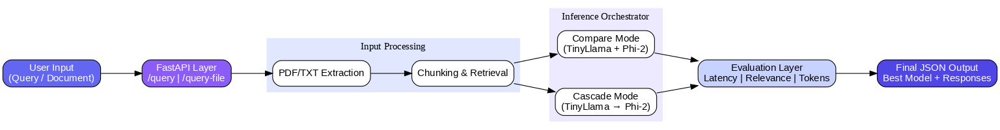

# LLM Comparator (FastAPI + React-ready)

A web backend for side-by-side comparison of multiple LLM responses with confidence-based cascading.

## High-Level Design



## Implementation Details

- **Framework:** `FastAPI` for API development and request handling.
- **Models:** `TinyLlama` and `Phi-2` via `transformers` pipelines.
- **Routing strategies:**
  - `compare_fast` / `compare_full`
  - `cascade_fast` / `cascade_full`
- **Why this approach:**
  - compare modes give transparent side-by-side quality checks.
  - cascade modes reduce compute by escalating only when confidence is low.
  - lightweight lexical retrieval and token estimation keep runtime simple and cost-aware.

## API Endpoints

- `GET /` -> health string (`API is running`)
- `POST /query` (JSON)
  - body:
    ```json
    {
      "query": "Explain this text",
      "mode": "cascade_fast"
    }
    ```
- `POST /query-file` (multipart/form-data)
  - fields:
    - `file` (`.txt` or `.pdf`)
    - `query` (optional)
    - `mode` (optional, default `compare_fast`)
    - `page_start` (optional, 1-indexed)
    - `page_end` (optional, 1-indexed)

## Build and Run

1. Create and activate virtual environment.
2. Install dependencies:
   ```bash
   pip install -r requirements.txt
   ```
3. Start backend:
   ```bash
   uvicorn backend.main:app --reload
   ```
4. Open Swagger:
   - [http://127.0.0.1:8000/docs](http://127.0.0.1:8000/docs)

## Testing Checklist

- `GET /` returns `"API is running"`.
- `/query` works in `compare_fast`, `compare_full`, `cascade_fast`, `cascade_full`.
- `/query-file` works with `.txt` and `.pdf`.
- PDF page-range extraction works with `page_start`/`page_end`.
- Cascade only escalates on low confidence or truncation.
- Outputs include latency and token usage estimates.

## Security Notes

- Credentials should be stored in environment variables only.
- `.env` is excluded via `.gitignore`.
- Avoid committing sensitive data (API keys, PII, personal emails).

## License

This project is licensed under the Apache License 2.0. See `LICENSE`.
